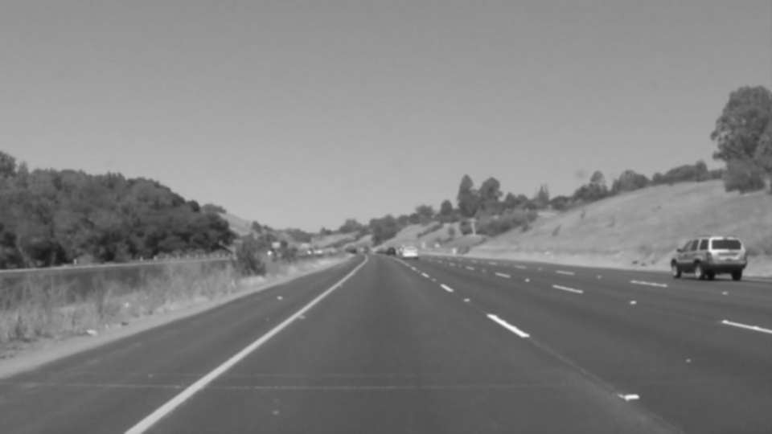
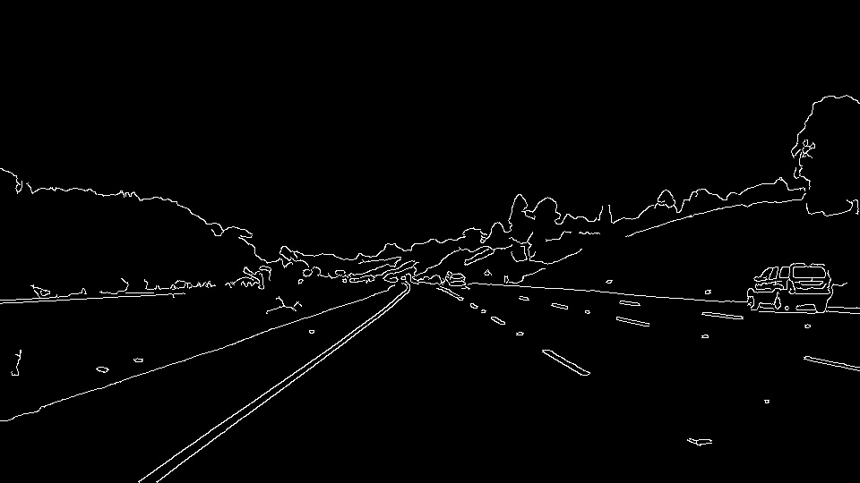
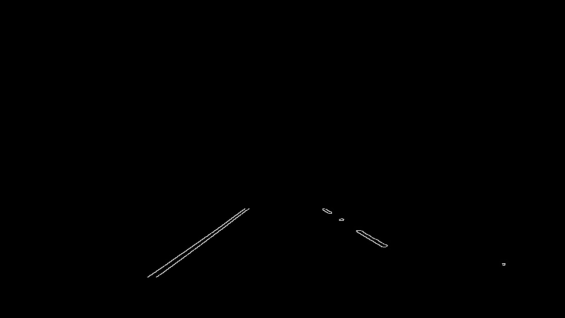
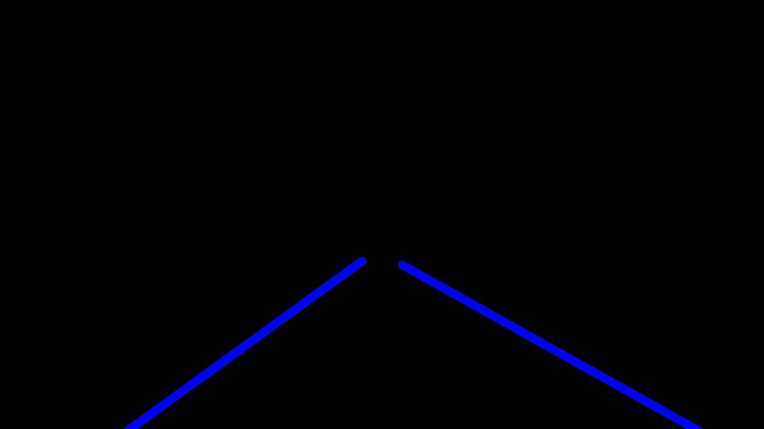
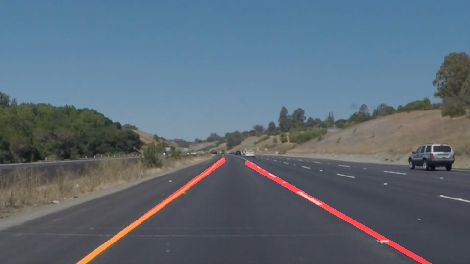

# **Finding Lane Lines on the Road** 

#### Udacity Self-Driving Car NanoDegree Project #1
#### Author: Tomas Mawyin

---

**Project Goals**

The goals / steps of this project are the following:
* Make a pipeline that finds lane lines on the road
* Reflect on the work in a written report

**Project Setup**

The project consists on finding lane lins on the roads initially on static images and later in videos. Helper functions were provided to aid in the Python code development. These functions made use of four main Python libraries: 1) Open CV for computer vision and image processing, 2) Numpy for handling vectors or matrices, 3) Matplotlib for helping in the image post-processing and plotting, and 4) Moviepy for handling videos. 

[//]: # (Image References)

[image1]: ./writeup_Images/gray_image.jpg "Grayscale + Gaussian Blur"
![alt text][]

---

### 1. Methodology - How the pipeline was created

As stated in the Project Setup section, the initial portion of the project was to detect lane lines on a set of images. To do this, I generated a function called _find_\__lanes()_ that would take the original image and will output the same image with the lines detected and highlighted in red color. 

The function consists on 7 steps, outlined here:
1. The first step in the function is to make a working copy of the image. This will avoid modifying the original image.
2. The second step is to use the one of the helper functions provided to change the image to a grayscale. The function `grayscale()` returns an image that gets rescaled from an RGB value to a grayscale value.
3. The thirs step is to apply a filter to the image, in this case we make use of the `gaussian_blur()` function to smooth the gray-scaled image and ensure noise in the image is reduced. The image shown here is an example of applying steps 2 and 3 to the image.

4. The fourth step is to make use of the Canny Edge detection algorithm to find the "edges" of the images. An edge is detected by looking at the color gradient in the image and selecting those locations in the image where there is high change in gradient. The helper function `canny()` help us detect such edges by proving a hysterisis where any point about the higher threshold is kept, any point below a lower threshold is eliminated, and any point in between is kep as long as it is connected to an edge.

5. The next step, now the edges are detected (including lane lines), is to focus on the area of insterest where only the lane lines can be perceived. The function `region_of_interest()` helps in generating a polygon that will become our area of interest. Given the ploygon vertices, this function will mask and black out any region outside the polygon leaving the edges from the previous step only inside the polygon area.

	The vertices of the polygon were generated based on the image size. This was done because the perspective of the lanes start near the center of the image and expand towards the right and left bottom sides of the image. An example figure is shown below showing the edge image masked by the area of interest. 

6. The sixth step is to perform a Hough transformation to help in the detection of lanes. This method converts any point from the cartesian space (x, y) to sinusoidal curves in the polar (rho, theta) space. By using a voting scheme, the intersections of the sine curves help in the detection of points in the x-y space that form a line, thus giving us a confindent method of finding lane lines in the image. The function `hough_lines()` is used to apply the transformation and generate the required set of lines. The function works by providing parameters such as "threshold" which specifies the minimum number of votes for a set of points to be considered part of a line. Other parameters such as the resolution of rho, thetha and the minimum length and gap to be considered between lines is also required to adjust the line searching procedure.

	Finally, the function call another helper function called `draw_lines()` to take the points from the Hough transform and draw the corresponding lines on top of the masked image from the step above. Typically, for broken lane lines, the hough transform provides multiple small lines which might be confusion for a self-driving car. For this reason, some modifications were done to this function to draw are single set of lines that were extrapolated from the original detected lines. Here are the modifications:

	* From the set of points given by the Hough transform, the slope of each line is calculated with the notion that right lanes and left lanes in the image have positive and negative slopes respectively.
	* The points that form the left lanes are then separated from those point that form the right lanes. The points are then averaged out as they are located in a similar place, this will help in keeping only two set of (x,y) points for each side.
	* If the points exist on either side, i.e., if the lane was detected, then the function `polyfit()` from the Numpy library is used to find the equation of the line that passes through given set of points.
	* The size of the image is used to find the extreme points on the "x" component for each line. The equation of the line is then used to get the "y" value, leaving us with two new (x,y) pair of points that correspond to extrapolated versions of the initial x-y pairs.
	* Finally, the new extrapolated lines are drawn in the image with a higher thickness value. See the image below as an example

  

7. The final step in the pipeline is to combine the original image with the image that contains the extrapolated lines. The function `weighted_img()` helps with this. The final image then looks something like the example below.

### 2. Potential shortcomings

The method described above has some limitations. Here are some of the shortcomings of this method:

1. The lane lines can only be detected if they are very well marked and in a location that is central to the image. This is because lane lines that are not well marked can blend with the road which will make it difficult for the edge detection method to distinguish them. The location is also very important as there is only one "area of interest" defined in this pipeline (see step 5).

2. Another limitation of the pipeline is that only straight lines can be detected. Road with curved lanes are very difficult to detect with this method since drawing lines is only done with x-y points assuming a straight line connection.

3. Difficulties in lane detection will arise if there are obstacles near the lane lines. Obstacles can blend with the environment and can be perceived as "edges" in the algorithm.

### 3. Possible improvements 

To overcome the previously mentioned shortcoming, here are a few possible improvements:

1. Other advanced techniques can be used to detect lane lines, this can include taking into consideration the actual size of the lane and the far-ahead projection of the lanes in the road.

2. To detect curved lanes, the methods implemented will have to consider more points and do not assume there is a linear connection between the points. For such methods, the curvature of the points can be calculated and based on this the curve or splines can be drawn onto the image.

3. When other obstacles are present in the road, the algorithm must help us with the detection of such obstacles. One method to avoid this is to provide a machine learning method to identify possible objects and avoid those. Another way of doing this would be to apply multiple and small regions of interest to the image where the lanes are.
